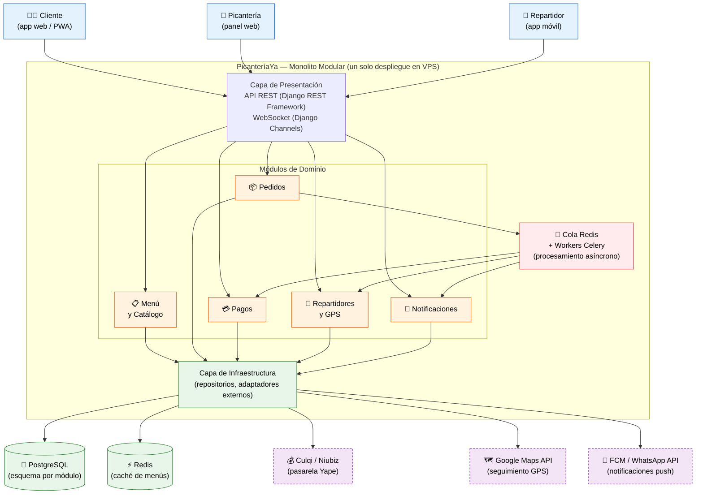

# PicanteríaYa — Laboratorio 04: Fundamentos de arquitectura de software

Construcción de Software · EPIS-UNSA · 2026-B · Grupo XX

---

## Integrantes

| Nombre | Rol en el laboratorio |
|--------|-----------------------|
| Baca Calsin Leonardo Juan Jose | Redactor de drivers y escenarios de calidad (E1), revisión de ADR |
| Chipana Jeronimo German Arturo | Diagramador (E3, E5, E6), configuración del repositorio |
| Mejia Rondan Giovanni Patrick | Redactor de ADR (E4), bitácora de IA (E7) |

---

## Caso

**PicanteríaYa** es una plataforma de delivery de picanterías arequipeñas que conecta a clientes, picanterías y repartidores. Los clientes consultan el menú del día de cada picantería, realizan pedidos y pagan con Yape; el sistema asigna automáticamente un repartidor disponible y el cliente puede seguir la ubicación del repartidor en tiempo real en el mapa.

El **atributo de calidad crítico** es la **escalabilidad**: los domingos de 12:00 a 15:00 los pedidos se multiplican por 8 respecto al flujo base (~50 pedidos/hora), alcanzando hasta **400 pedidos/hora**. La arquitectura debe absorber este pico sin rechazar pedidos ni degradar la experiencia del usuario (p95 del tiempo de confirmación ≤ 4 s, 0 pedidos rechazados por sobrecarga).

---

## Arquitectura elegida

**Estilo: Monolito Modular + Cola de mensajes Redis/Celery**  
Puntaje en matriz de decisión: **4,20 / 5,00** (ver [matriz-decision.md](docs/architecture/matriz-decision.md))



---

## Decisiones arquitectónicas

- [ADR-001: Estilo arquitectónico — Monolito modular con cola de mensajes](docs/architecture/adr/001-estilo-arquitectonico.md)
- [ADR-002: Base de datos — PostgreSQL con esquemas separados por módulo](docs/architecture/adr/002-base-de-datos.md)
- [ADR-003: Comunicación en tiempo real — WebSocket con Django Channels](docs/architecture/adr/003-comunicacion-tiempo-real.md)

---

## Estructura del repositorio

```
cs-2026b-lab04-grupoXX/
├── README.md
└── docs/
    └── architecture/
        ├── drivers.md               # E1: drivers y escenarios de calidad
        ├── matriz-decision.md       # E2: alternativas y decisión ponderada
        ├── bitacora-ia.md           # E7: 5+ interacciones con IA verificadas
        └── diagramas/
            ├── arquitectura.mmd     # E3: Mermaid — arquitectura elegida
            ├── alternativa.puml     # E5: PlantUML — alternativa descartada
            ├── despliegue.py        # E6: Python Diagrams — vista de despliegue
            └── img/                 # Imágenes exportadas (PNG/SVG)
        └── adr/
            ├── 000-plantilla.md
            ├── 001-estilo-arquitectonico.md
            ├── 002-base-de-datos.md
            └── 003-comunicacion-tiempo-real.md
```

---

## Reflexión sobre el uso de la IA

El uso de asistentes de IA en este laboratorio aceleró significativamente las primeras etapas del diseño: en minutos obtuvimos tres alternativas arquitectónicas con sus pros y contras, y borradores de ADR bien estructurados. Sin embargo, la IA demostró limitaciones importantes que obligaron al equipo a ejercer juicio crítico.

El error más revelador fue que Claude asumió que **Yape dispone de una API pública abierta** para integración directa, lo cual es incorrecto: verificamos en la documentación oficial de Yape y en foros de desarrollo peruano que la integración requiere un proveedor intermediario con acuerdo comercial. Este error habría impactado directamente el MVP si lo hubiéramos aceptado sin verificar.

También notamos que la IA tiende a **proponer arquitecturas sobredimensionadas**: recomendó Kubernetes y microservicios para 400 pedidos/hora, cuando calculamos que equivale a 6–7 pedidos/minuto, perfectamente manejables con un monolito y una cola asíncrona. La IA no ponderó nuestras restricciones de equipo (3 developers sin DevOps) ni de presupuesto (VPS único de $20/mes).

El aprendizaje central: **la IA es un excelente generador de borradores y listas de opciones**, pero no conoce el contexto real del proyecto ni las restricciones del equipo. Cada propuesta debe verificarse contra la documentación oficial y los drivers del sistema.

---

## Recursos y herramientas

- Editor Mermaid en línea: https://mermaid.live
- Editor PlantUML en línea: https://www.plantuml.com/plantuml
- Python Diagrams: https://diagrams.mingrammer.com/
- Guía de la práctica: `Guia_Lab04_Fundamentos_Arquitectura_Software_2026B.pdf`
